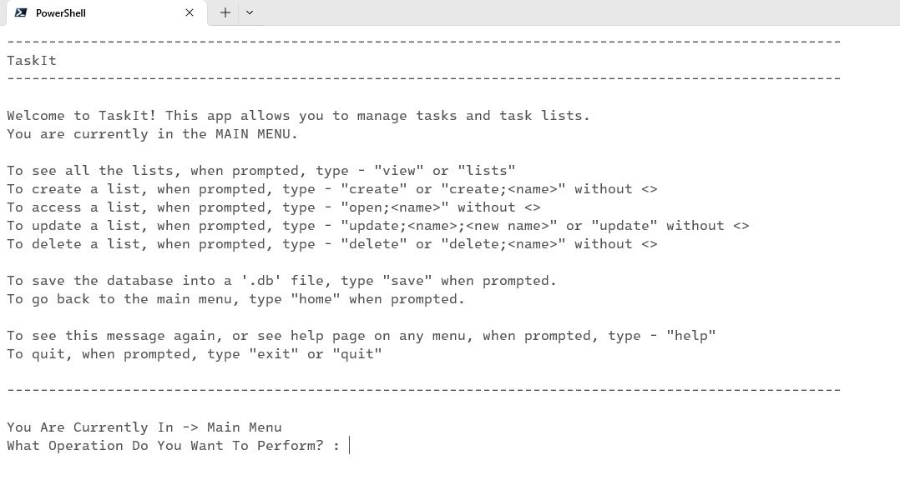
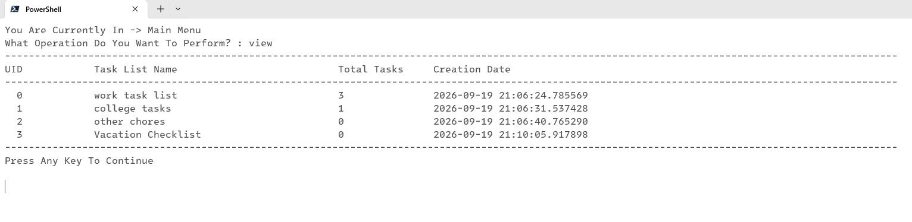
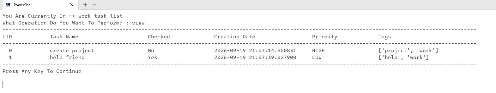

# TaskIt

A simple yet elegant app that allows one to do task management.

It's main purpose is to help manage time by using the concept of task creation, where one can assign tasks as per their requirements.

In general, it can be used for any purpose where a task manager may be required.

It is created as per the requirement of my university's Python course.

A project report has been included in the project under `assets/report` -> [Report Link](assets/report/TaskIt_Project_Report.pdf)
A statement report is also included in the project -> [statement.md](statement.md)
The graphs and schemas for all are included in the project report.

## Features
- Task Lists with CRUD operations.
- Tasks inside Task Lists with CRUD operations.
    - Can input priority of task.
    - Can input tags for a particular task.
- Saves / Loads database in / from an SQLite `.db` file.

## Programatic Features
- Modular
- Easy To Maintain
- Self Documented Code
- Lightweight
- Offline
- Persistent Data Storage

## Technologies Used
- Python
- SQLite3

# Non Functional Requirements
- Performance
    - The app has been designed to be as fast as possible without any unnecessary external factor like internet affecting it.
- Usability
    - It has been designed to be as simple and easy to use for a user as possible, with properly documented error messages.
- Reliability
    - The app preserves data via a `SQLite` database, meaning the data is never lost and is reliable in loading and saving.
- Maintainability
    - Due to it's simple Object Oriented style, the program has excellent maintainability.
- Resource Efficiency
    - The program is very resource efficient sa it does not waste resources with useless UI or Server Connections.

## Tools Used
- Visual Studio Code (to make the project in)
- `sqliteviewer` (to view the database easily, [link](https://beta.sqliteviewer.app/))

## Build And Run
- Clone the repository.
- Run `main.py` using command-line, while being in the parent directory and not the 'src' directory.

## Test
Test cases are as follows - 
- Create A Task List
- Rename A Task List
- Create A Task
- Set Its Priority
- Add Tags
- Check Or Uncheck The Task
- Update The Task
- Delete The Task
- Save The Database
- Restart The App
- Verify Everything Persisted
- Delete Task List

## About
This app was made by me (`real-xp` / won't use my real name here) for a University Course project for the `Python Essentials` course specifically.

No AI was used in any stage of development of this app. Neither was it used for consultation or documentation nor was it used for any code copying or vibecoding.

Everything in this app has been built with traditional documentation, manual pages and careful and considerate planning (and pure human stupidity too).

If you find any issues, send it over using the `Issues` tab of `GitHub`.